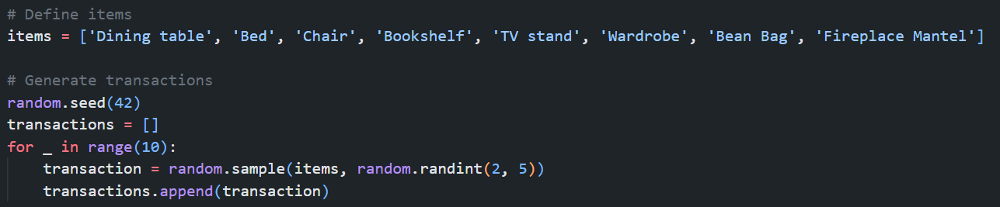
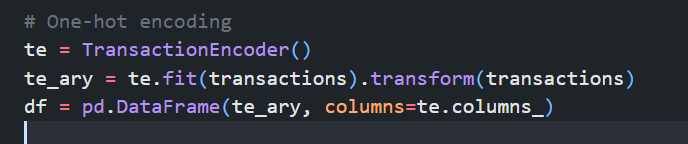
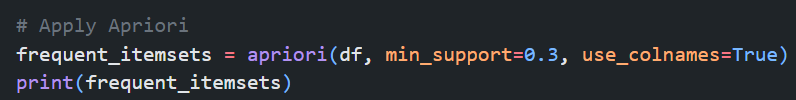
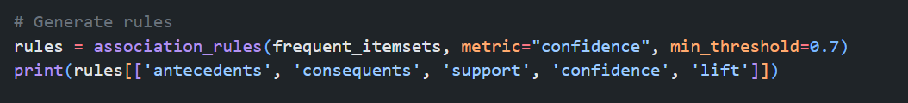

# Samantha-association-mini
ASSOCIATION MINI PROJECT
#SIMULATE TRANSACTION DATA
I created a list of furniture items. Then I debugged the code to lock the randomness for repeatability, and created an empty list for customers who come in and make a purchase.

The process runs 10 times, simulating a customer making purchases of 2 to 5 random items.

Finally, I performed indexing for efficiency.

Because of random.seed(42) , the output will always be the same unless you change the seed or remove it.

#ANALYZE WITH APRIORI.

Converts the Boolean array into a pandas DataFrame so it’s easier to read and process. Each column tells you if they bought that item.

Displays the frequent itemsets, along with their support values; how common they are across all transactions.

It shows that the Dining Table and Bean Bag appears in 50% of transactions, that is the highest transaction
It shows that the Chair and Fireplace Mantel appears in 30% of transactions, that is the least transaction

#GENERATE RULES.

antecedents- the items someone already bought.

consequents- the item they’re likely to buy next.
Customers who buy a chair are also very likely to get a TV stand, so maybe place them near each other in the store or offer them as a bundle

Confidence(A→B)= Support(A) / Support(A∩B)

​Support(A ∩ B) = How many transactions include both A and B

Support(A) = How many transactions include just A

